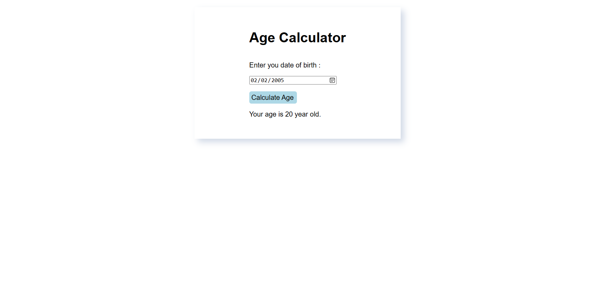

# 🧮 Age Calculator

This is a simple and interactive **Age Calculator** built using **HTML, CSS, and JavaScript**. Enter your date of birth, and it instantly calculates your age in **years**.

## 🚀 Live Demo

🔗 [Click to try it now](https://kumar-veerendra.github.io/age-calculator/)

## 📸 Screenshot



> 📌 Make sure the screenshot file is named `screenshot.png` and placed in the root directory.

## 🛠️ Technologies Used

- HTML
- CSS
- JavaScript

## 📂 Features

- Clean and responsive UI
- Calculates age in:
  - Years
- Instant calculation without page reload

## 🧾 How It Works

1. The user selects their date of birth.
2. On clicking the **"Calculate Age"** button, the script calculates the age based on the current date.
3. The result is shown dynamically below the form.

## 🗂️ Project Structure

```
📁 age-calculator/
├── index.html
├── style.css
├── script.js
└── screenshot.png
```

## 👨‍💻 Author

- **Veerendra Kumar**
- 🌐 [Portfolio](https://veerendrakumar-portfolio.netlify.app/)
- 🐙 [GitHub](https://github.com/kumar-veerendra)

## 📃 License

This project is licensed under the [MIT License](LICENSE).
